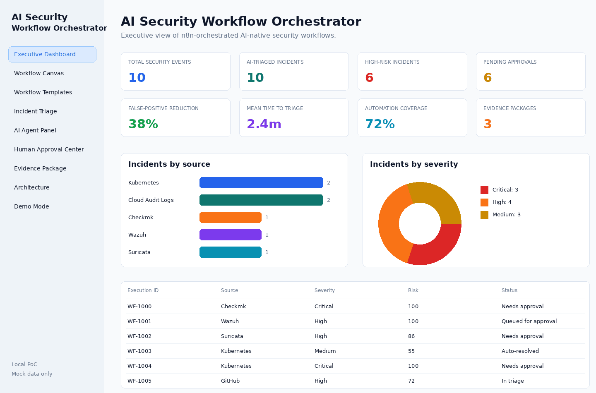
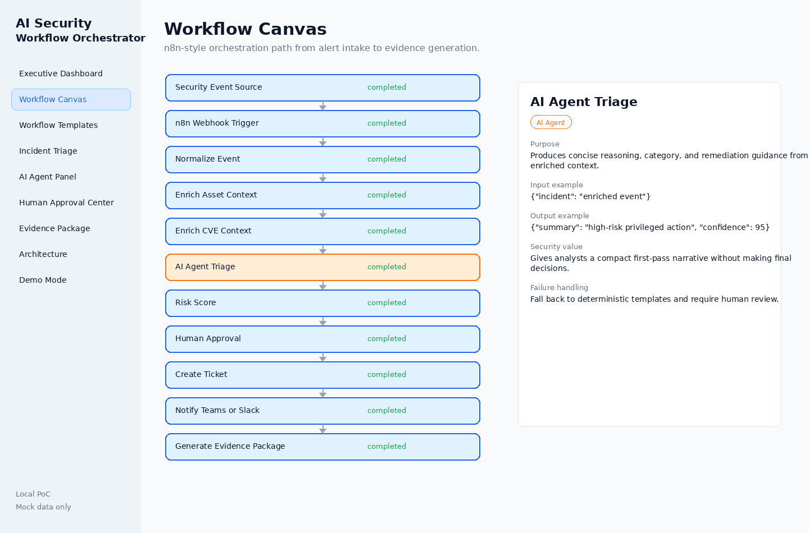
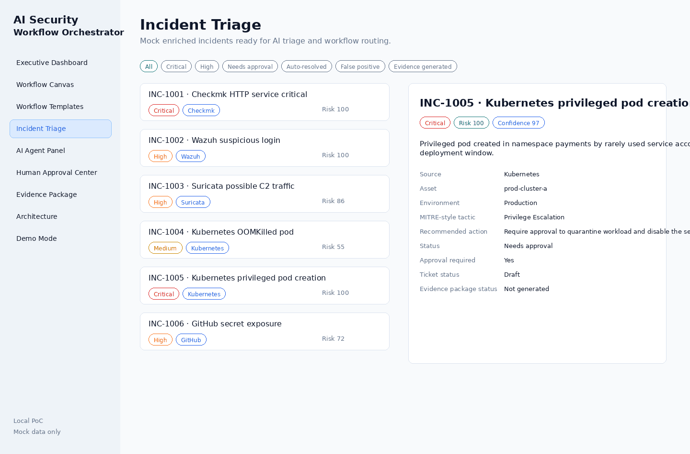
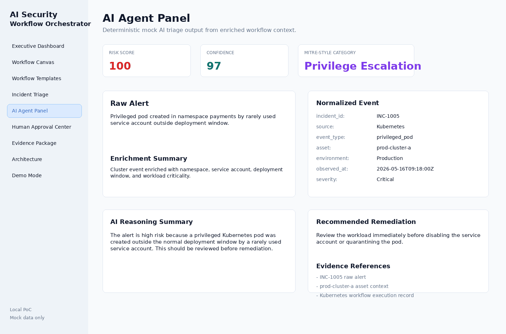
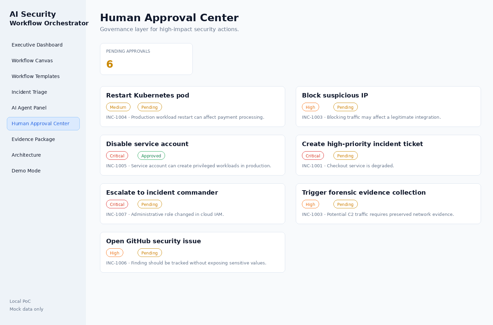
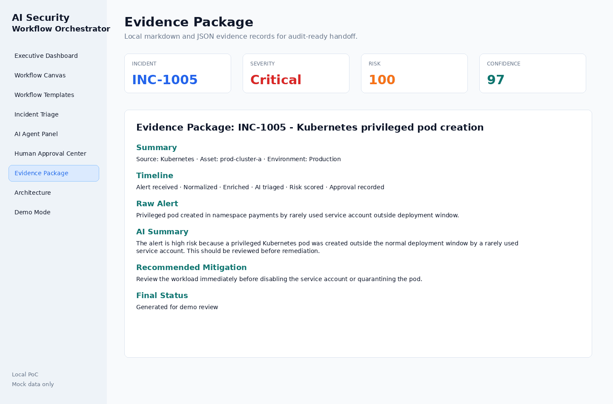
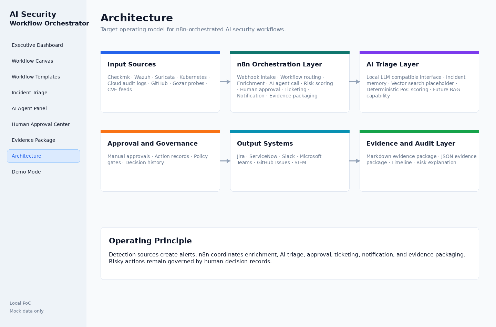
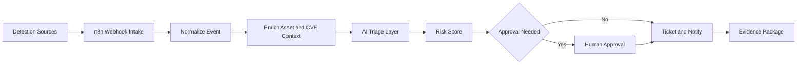

# AI Security Workflow Orchestrator

AI Security Workflow Orchestrator is a local, clickable Python PoC that demonstrates how n8n can serve as the workflow orchestration layer for AI-native security operations.

The demo uses mock data only. It does not require a running n8n instance, does not call external APIs, and does not use real credentials or customer data.

## Purpose

Security teams already receive alerts from tools such as Checkmk, Wazuh, Suricata, Kubernetes, GitHub, cloud audit logs, CVE feeds, and access probes. This PoC shows how n8n can sit between those detection sources and the downstream response process.

n8n is not the detection engine. In this architecture, n8n receives webhook-style alerts, normalizes them, enriches context, calls an AI triage layer, routes risky actions for human approval, creates tickets or notifications, and packages evidence.

## What The PoC Demonstrates

- Executive dashboard for security workflow outcomes
- Clickable workflow canvas with n8n-style node details
- Reusable workflow templates for common security operations
- Incident triage with mock enriched events
- Deterministic mock AI triage without an LLM dependency
- Human approval center for high-impact actions
- Markdown and JSON evidence package generation
- Architecture view for stakeholder conversations
- One-click demo mode for a full incident walkthrough

## Screenshots















## Architecture Overview



## Local Setup

```bash
python -m venv .venv
```

For Linux/macOS:

```bash
source .venv/bin/activate
```

For Windows PowerShell:

```powershell
.venv\Scripts\Activate.ps1
```

Then install dependencies and run the app:

```bash
pip install -r requirements.txt
streamlit run app.py
```

## Demo Walkthrough

1. Open **Executive Dashboard** to show KPIs, trends, and recent workflow executions.
2. Open **Demo Mode** and select **Run Demo Incident**.
3. Open **Workflow Canvas** to show how n8n coordinates the alert path.
4. Open **AI Agent Panel** to explain deterministic AI triage output.
5. Open **Human Approval Center** to show approval governance.
6. Open **Evidence Package** to preview or generate markdown and JSON evidence.
7. Open **Architecture** to connect the PoC to a production roadmap.

## Folder Structure

```text
.
├── app.py
├── requirements.txt
├── README.md
├── data/
│   ├── mock_incidents.json
│   ├── workflow_templates.json
│   ├── mock_assets.json
│   └── mock_cve_context.json
├── components/
│   ├── dashboard.py
│   ├── workflow_canvas.py
│   ├── workflow_templates.py
│   ├── incident_triage.py
│   ├── ai_agent_panel.py
│   ├── approval_center.py
│   ├── evidence_package.py
│   ├── architecture.py
│   └── demo_mode.py
├── utils/
│   ├── scoring.py
│   ├── mock_ai.py
│   ├── exporters.py
│   └── state.py
├── screenshots/
└── docs/
    ├── architecture.md
    └── demo_script.md
```

## Production Roadmap

- Replace mock webhook intake with n8n production webhooks.
- Replace static JSON enrichment with CMDB, vulnerability, identity, and ticketing integrations.
- Add a local or private-model AI interface with strict prompt and data-handling controls.
- Add durable workflow execution storage and approval audit logs.
- Add signing and retention controls for evidence packages.
- Add role-based access control for demo actions that become production actions.
- Add integration tests for workflow payload schemas.

## Security Disclaimer

This repository is a local demonstration only. It uses mock incidents, mock enrichment, mock AI output, and local evidence files. Do not place real API keys, real credentials, or live customer data in the app, mock data, screenshots, or generated evidence packages.
